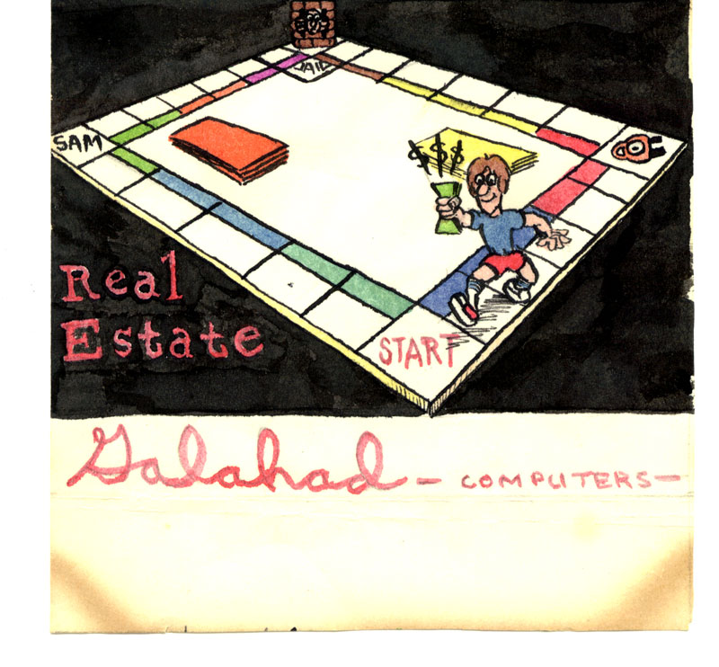

# Real Estate

1982 (or so, I was 16 years old!) implementation of the Monopoly game on Color Computer. [The listing](https://github.com/fuhrmanator/real-estate/blob/master/monop1.bas) was recovered from of a WAV file from a cassette tape using the emulator written by David Keil at https://colorcomputerarchive.com/repo/Emulators/Coco%201-2/David%20Keil/doc/cocodoc.htm

Many of the WAV files would not load in the emulator. 

The final version of this game had a graphical map that would be loaded into the graphics memory of the computer and could be displayed as needed (toggled with a hot key).

The cassette cover art was done by [Sam Valentino](https://www.linkedin.com/in/sam-valentino-1799757/).
